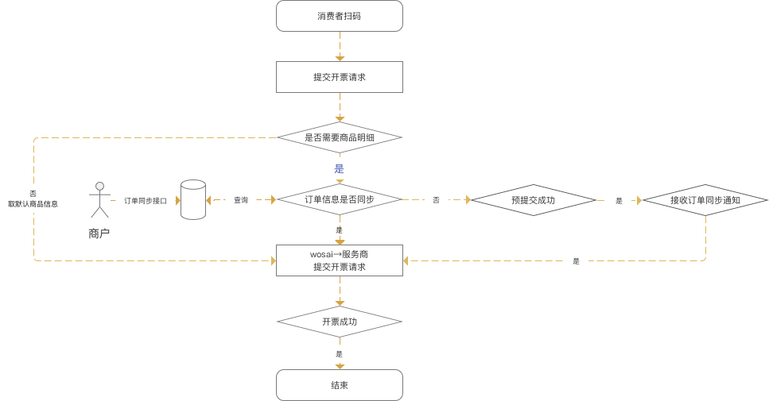

# H5开票（订单上传）
##简介
订单上传式H5开票方案提供了相对更为便利的开票方式，用户只需根据收钱吧文档将订单信息上传，并按照二维码生成规则打印二维码，消费者即可直接扫码开票。

##接口一览

###[激活接口](api/interface/activate.md)
###[签到接口](api/interface/checkin.md)
###[开票相关接口](api/interface/invoice_output.md)
    